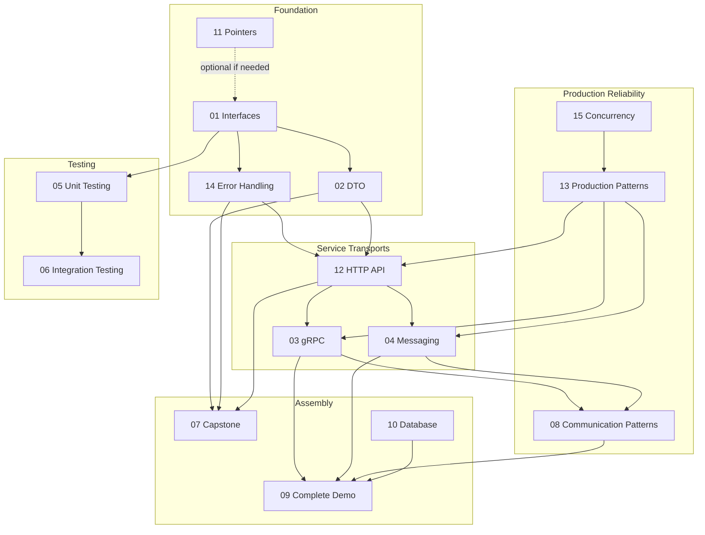

# 🎓 Learn and Go

This project will teach you how to write microservices in Go correctly.  
Each module is a separate folder with code, explanations and working tests.

**Target audience:** Middle → Senior Go-developer.  
**Approach:** theory + code + tests + “as in production”.

If you prefer diagrams before details, start with [`VISUAL_GUIDE.md`](VISUAL_GUIDE.md). It shows the course path, request flow, layer boundaries, communication choices, and a few compact code shapes.

If a module feels too dense, use [`STUDY_GUIDE.md`](STUDY_GUIDE.md). It gives every module a simple explanation, first files to read, a small practice task, and a checkpoint.

---

## 🗺️ Learning Map

### Basics (foundation)

| # | Folder            | Topic                     | What will you study                                               |
|---|-------------------|---------------------------|-------------------------------------------------------------------|
| 1 | `01_interfaces/`  | Interfaces and patterns   | Duck Typing, nil interface, Repository, Decorator, SOLID          |
| 2 | `02_dto/`         | DTOs and data layers      | Transport/Domain/Persistence, mapping, partial update             |
| 11 | `11_pointers/`   | Pointers `&` `*` `new()`  | Address, dereference, value/pointer receiver, Go 1.26 `new(expr)` |

### Communication between services

| # | Folder                       | Topic                 | What will you study                                       |
|---|------------------------------|-----------------------|-----------------------------------------------------------|
| 3 | `03_grpc/`                   | gRPC                  | Protobuf, 4 RPC types, error codes, interceptors, bufconn |
| 4 | `04_messaging/`              | Messaging / Events    | Pub/Sub, idempotency, DLQ, delivery guarantees            |
| 8 | `08_communication_patterns/` | When gRPC, when Kafka | Saga, Outbox, CQRS, decision map                          |

### Testing

| # | Folder                    | Topic                 | What will you study                               |
|---|---------------------------|-----------------------|---------------------------------------------------|
| 5 | `05_unit_testing/`        | Unit tests with mocks | Manual mocks, testify mocks, dependency isolation |
| 6 | `06_integration_testing/` | Integration tests     | testify/suite, setup/teardown, state isolation    |

### Production patterns ⭐ NEW

| # | Folder                       | Topic                   | What will you study                                                      |
|---|------------------------------|-------------------------|--------------------------------------------------------------------------|
| 12 | `12_http_api/`               | **HTTP API**            | net/http 1.22+, handlers, middleware, JSON errors, httptest             |
| 13 | `13_production_patterns/`    | **Production Patterns** | context.Context, graceful shutdown, slog, config, retry, circuit breaker|
| 14 | `14_error_handling/`         | **Error Handling**      | Custom types, behavioral errors, wrapping, errors.Join, error mapping   |
| 15 | `15_concurrency_patterns/`   | **Concurrency**         | Worker pool, fan-out, errgroup, rate limiter, semaphore, pipeline       |

### Assembly and integration

| # | Folder              | Topic                | What will you study                                                |
|---|---------------------|----------------------|--------------------------------------------------------------------|
| 7 | `07_capstone/`      | All Together (Basic) | Order Service - collection of all patterns                         |
| 9 | `09_complete_demo/` | Complete system      | Running demo: OrderSvc + InventorySvc + Events                     |
| 10 | `10_database/`     | PostgreSQL + Docker  | sqlx, migrations, transactions, soft delete, optimistic lock, JOIN |

---

## 🔀 Module relationship map

This is a relationship map, not a strict sequence. Use **Study order** below for the recommended learning path.



---

## 🚀 Run all tests

```bash
# All modules (except DB):
go test ./... -v

# With race detector (recommended):
go test ./... -race -v

# Module 10 (requires Docker):
docker compose -f 10_database/docker-compose.yml up -d
go test ./10_database/... -v
```

## 🎬 Launch interactive demo

```bash
go run ./09_complete_demo/cmd/main.go
```

---

## 📚 Study order

### Path 1: From scratch (recommended)

1. **`11_pointers/`** - if you are not sure about pointers
2. **`01_interfaces/`** - foundation. Without understanding interfaces you can't go any further.
3. **`14_error_handling/`** ⭐ — error patterns (sentinel → custom → behavioral)
4. **`02_dto/`** - why you can’t use one structure everywhere
5. **`13_production_patterns/`** ⭐ — context.Context, slog, config, retry, circuit breaker
6. **`12_http_api/`** ⭐ — handlers, middleware, JSON errors
7. **`03_grpc/`** - synchronous communication between services
8. **`04_messaging/`** - asynchronous communication, idempotency, DLQ
9. **`05_unit_testing/`** - how to test without real dependencies
10. **`06_integration_testing/`** - how to test with real components
11. **`15_concurrency_patterns/`** ⭐ — worker pool, fan-out, rate limiter
12. **`08_communication_patterns/`** — Saga, Outbox, CQRS
13. **`07_capstone/`** - all together in one service
14. **`09_complete_demo/`** - a launchable system of several services
15. **`10_database/`** - PostgreSQL, sqlx, migrations

### Path 2: Quick start (already know Go)

1. `13_production_patterns/` → `12_http_api/` → `14_error_handling/` → `15_concurrency_patterns/`

> In each README, first there is **theory**, then **code**, then **tests**.  
> `// 👉` comments in the code explain key decisions.

---

## 💡 Key ideas of the course

> **Interfaces** are contracts. The code depends on the contract, not on the implementation.

> **context.Context** is the first parameter of EACH method. Without it there are no timeouts, cancellations and tracing.

> **Structured Logging** - `slog` instead of `fmt.Println`. JSON is for machines, text is for people.

> **Error Handling** — sentinel → custom types → behavioral. `errors.Is`/`errors.As`, not string comparison.

> **HTTP API** - decode → validate → service → encode. Middleware for cross-cutting concerns.

> **gRPC** is a strongly typed synchronous protocol. Use it when you need an answer now.

> **Messaging** - services do not know about each other. Idempotency is required.

> **Circuit Breaker** - one failed service should not bring down the entire system.

> **Concurrency** - worker pool, not a goroutine for each task. errgroup, not WaitGroup + manual errors.

---

## 🏗️ Architecture of the final system (Module 9)

```
HTTP API (main.go) ← Module 12
       │
       ▼
OrderService ──sync──▶ InventoryService ← Module 03 (gRPC)
       │ + Circuit Breaker (Module 13)
       │──async──▶  EventBus  ──▶  NotificationService
                              ──▶  AnalyticsService
← Module 04 (Kafka) + Idempotency + DLQ
```

All dependencies are via interfaces.  
In tests - in-memory implementations.  
In production - real Postgres/Kafka/gRPC clients.

---

## 📋 Prerequisites

- Go 1.22+ (for HTTP pattern routing)
- Docker (for modules 06, 10)
- Basic understanding of Go (variables, functions, structures, goroutines)
