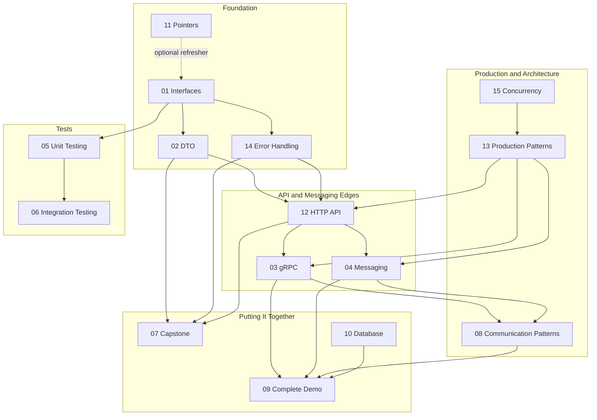
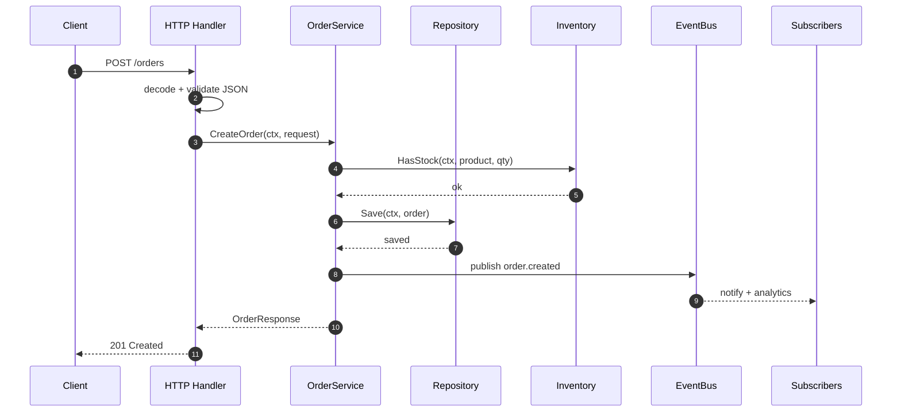
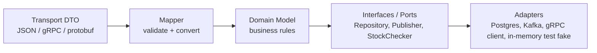
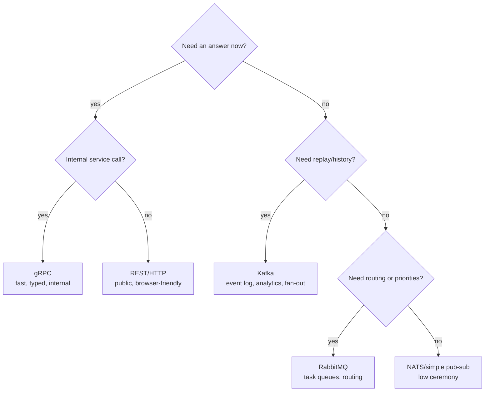
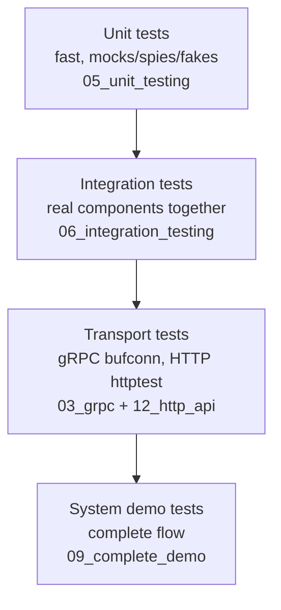

# Learn and Go - Visual Guide

Use this guide before opening a module README. It gives you the mental model first, then points you to the code that makes the model real.

## 1. Course Map



This map shows relationships between topics. It is not a strict order. For example, Module 10 is a database deep dive, but the complete demo also teaches how a final system is wired together.

## 2. One Request Through The System



This single flow connects most modules: DTO mapping, interfaces, context, repository, sync communication, async events, and tests.

## 3. Layer Boundaries



Rule of thumb: dependencies point inward. The domain should not import HTTP, database, Kafka, or gRPC packages.

## 4. Communication Decision Tree



Use this before choosing a protocol. Most architecture mistakes come from forcing one tool into every communication problem.

## 5. Testing Pyramid For This Repo



Prefer many unit tests, enough integration tests to prove wiring, and a small number of system tests for the happy path plus critical failures.

## 6. Code Sample: Interface-First Service

```go
type OrderRepository interface {
    Save(ctx context.Context, order *Order) error
    FindByID(ctx context.Context, id string) (*Order, error)
}

type EventPublisher interface {
    Publish(eventType string, payload any) error
}

type OrderService struct {
    repo      OrderRepository
    publisher EventPublisher
}

func NewOrderService(repo OrderRepository, publisher EventPublisher) *OrderService {
    return &OrderService{repo: repo, publisher: publisher}
}
```

The service accepts behavior, not a concrete database or broker. That is why the same business logic can run with in-memory fakes in tests and real adapters in production.

## 7. Code Sample: Handler Shape

```go
func (h *Handler) CreateOrder(w http.ResponseWriter, r *http.Request) {
    ctx := r.Context()

    var req CreateOrderRequest
    if err := json.NewDecoder(r.Body).Decode(&req); err != nil {
        writeError(w, http.StatusBadRequest, "invalid JSON")
        return
    }

    resp, err := h.service.CreateOrder(ctx, req)
    if err != nil {
        writeError(w, mapError(err), err.Error())
        return
    }

    writeJSON(w, http.StatusCreated, resp)
}
```

Most HTTP handlers in production should follow this boring shape: decode, validate, call service, map errors, encode response.

## 8. Code Sample: Reliable Event Publishing Shape

```go
func (s *OrderService) CreateOrder(ctx context.Context, req CreateOrderRequest) error {
    return s.tx.Run(ctx, func(ctx context.Context) error {
        order := requestToDomain(req)

        if err := s.orders.Save(ctx, order); err != nil {
            return err
        }

        return s.outbox.Save(ctx, OutboxEvent{
            Type: "order.created",
            Payload: orderCreatedPayload(order),
        })
    })
}
```

Save the business record and the event record in one transaction. A worker publishes the outbox later. This avoids the classic "DB saved, event lost" failure.

## 9. Study Checklist

- Read the visual diagram first.
- Open the module README and skim the "what you learn" section.
- Read the production-shaped code.
- Run that module's tests.
- Break one test on purpose, then fix it.
- Move to the next module only when you can explain the main interface and the main failure mode.
